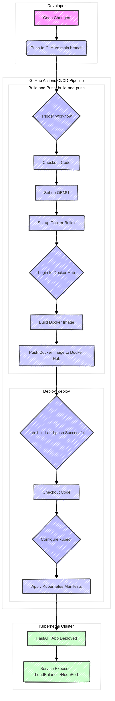

# FastAPI Kubernetes Deployment Guide

This guide will walk you through deploying a simple FastAPI application to a Kubernetes cluster.

## 1. Prerequisites

*   [Docker](https://docs.docker.com/get-docker/)
*   [kubectl](https://kubernetes.io/docs/tasks/tools/install-kubectl/)
*   [uv](https://github.com/astral-sh/uv)

For local deployment, you will also need:
*   [Minikube](https://minikube.sigs.k8s.io/docs/start/)

For cloud deployment, you will need a Kubernetes cluster on a cloud provider like GKE, EKS, or AKS.

## 2. Set Up the Project

1.  **Clone the repository (or create the files manually):**
    ```bash
    git clone <repository-url>
    cd fastapi-k8s-deployment
    ```

2.  **Create a virtual environment and install dependencies:**
    ```bash
    uv venv
    source .venv/bin/activate
    uv add -r requirements.txt
    ```

## 3. Dockerization

The `Dockerfile` in this repository uses `uv` to create a small and efficient Docker image.

### 3.1. The `Dockerfile` with `uv`

The `Dockerfile` uses `uv` to install the Python dependencies. `uv` is a fast Python package installer and resolver, written in Rust.

Here is a breakdown of the `Dockerfile`:

```dockerfile
# Use an official Python runtime as a parent image
FROM python:3.9-slim

# Set the working directory in the container
WORKDIR /app

# Copy the current directory contents into the container at /app
COPY . /app

# Install uv
RUN pip install uv

# Initialize a uv project
RUN uv init

# Install any needed packages specified in requirements.txt
RUN uv add -r requirements.txt

# Add .venv/bin to PATH
ENV PATH="/app/.venv/bin:$PATH"

# Run app.py when the container launches
CMD ["uvicorn", "main:app", "--host", "0.0.0.0", "--port", "80"]
```

### 3.2. Build the Docker Image

To build the Docker image, run the following command:

```bash
docker build -t fastapi-k8s:latest .
```

## 4. Kubernetes Deployment

### 4.1. Local Deployment (Minikube)

1.  **Start Minikube:**
    ```bash
    minikube start
    ```

2.  **Load the image into Minikube:**
    This makes the local image available to the Minikube cluster.
    ```bash
    minikube image load fastapi-k8s:latest
    ```

3.  **Apply the Kubernetes manifests:**
    This will create the Deployment and Service objects in Kubernetes.
    ```bash
    kubectl apply -f deployment.yaml
    kubectl apply -f service.yaml
    ```

### 4.2. Cloud Deployment (GKE)

For cloud deployment, it is recommended to change the `service.yaml` to use a `LoadBalancer` type. This will provision a cloud load balancer to expose the service to the internet.

**Before deploying to GKE, modify `service.yaml` as follows:**

```yaml
apiVersion: v1
kind: Service
metadata:
  name: fastapi-service
spec:
  selector:
    app: fastapi
  ports:
    - protocol: TCP
      port: 80
      targetPort: 80
  type: LoadBalancer # Change from NodePort to LoadBalancer
```

1.  **Create a GKE cluster** (or any other cloud-based Kubernetes cluster).

2.  **Configure `kubectl`** to connect to your cluster.

3.  **Apply the Kubernetes manifests:**
    ```bash
    kubectl apply -f deployment.yaml
    kubectl apply -f service.yaml
    ```

## 5. Accessing the Application

### 5.1. Local Deployment (Minikube)

Get the URL of the service:
```bash
minikube service fastapi-service --url
```
Open the returned URL in your browser. You should see `{"Hello":"World"}`.

### 5.2. Cloud Deployment (GKE)

1.  **Get the external IP address of the service:**
    ```bash
    kubectl get service fastapi-service
    ```
    Wait for the `EXTERNAL-IP` of the service to be assigned. This might take a few minutes.

2.  **Open the external IP address in your browser.** You should see `{"Hello":"World"}`.

## 6. CI/CD with GitHub Actions

This project is configured with a CI/CD pipeline using GitHub Actions. The workflow is defined in the `.github/workflows/main.yml` file.

### 6.1. The Workflow

The workflow has two jobs:

*   **`build-and-push`:** This job is triggered on every push to the `main` branch. It builds the Docker image and pushes it to Docker Hub.
*   **`deploy`:** This job is triggered after the `build-and-push` job is successful. It connects to your Kubernetes cluster and deploys the new image.

### 6.2. Set Up Secrets

To use the CI/CD pipeline, you need to configure the following secrets in your GitHub repository settings under "Settings" > "Secrets and variables" > "Actions":

*   **`DOCKERHUB_USERNAME`:** Your Docker Hub username.
*   **`DOCKERHUB_TOKEN`:** A Docker Hub access token with "Read, Write, Delete" permissions.
*   **`KUBECONFIG`:** The content of your flattened `kubeconfig` file for your Kubernetes cluster.

**Important:** The CI/CD pipeline is configured to deploy to a cloud-based Kubernetes cluster. It will not work with a local Minikube cluster out of the box, as the GitHub Actions runner cannot access your local machine.



## 7. Clean Up

### 7.1. Local Deployment (Minikube)

```bash
minikube service fastapi-service --url --disable
kubectl delete deployment fastapi-deployment
kubectl delete service fastapi-service
minikube stop
```

### 7.2. Cloud Deployment (GKE)

```bash
kubectl delete deployment fastapi-deployment
kubectl delete service fastapi-service
gcloud container clusters delete <your-cluster-name> --region=<your-cluster-region>
```